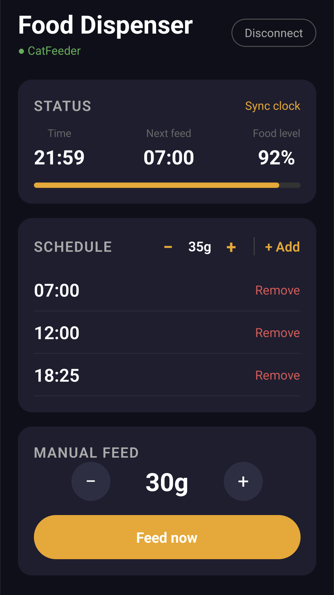

# Food Dispenser App

A React Native mobile app used as a controller for the **Food Dispenser** firmware:
[https://github.com/W-illum/food-dispenser/](https://github.com/W-illum/food-dispenser/)

The feeder runs on an Arduino Nano ESP32 and exposes a GATT BLE service. All feeding logic lives on the device, the app is purely a remote control.

Built with the help of [Claude Sonnet 4.6](https://www.anthropic.com/claude) by Anthropic.

---

## Overview

This app connects to the feeder over Bluetooth Low Energy and lets you control it from your phone, without having to use the rotary encoder on the device itself.



---

## Features

- **Scan & connect** - finds nearby feeders by name and connects over BLE
- **Live status** - displays the current device time, food level, and next scheduled feeding, updated every second
- **Clock sync** - syncs the feeder's clock to your phone's current time
- **Schedule** - view, add, and remove automatic feeding times (up to 4)
- **Scheduled amount** - set the default amount of food dispensed on each scheduled feeding
- **Manual feed** - dispense a custom amount of food on demand
- **Auto-disconnect** - automatically disconnects when you close or background the app, so the feeder is always available to reconnect

---

## Getting Started

### Prerequisites

- [Node.js](https://nodejs.org) (LTS)
- [Expo CLI](https://docs.expo.dev/get-started/installation/)
- An Android phone with the dev build installed (see below)

### Run in development

```bash
npx expo start
```

Scan the QR code with the Food Dispenser dev client app on your phone.

### Build a standalone APK

```bash
eas build --profile preview --platform android
```

This produces a self-contained APK that runs without a PC.

---

## Tech Stack

- [Expo](https://expo.dev) / React Native
- [react-native-ble-plx](https://github.com/dotintent/react-native-ble-plx) - BLE communication
- TypeScript
